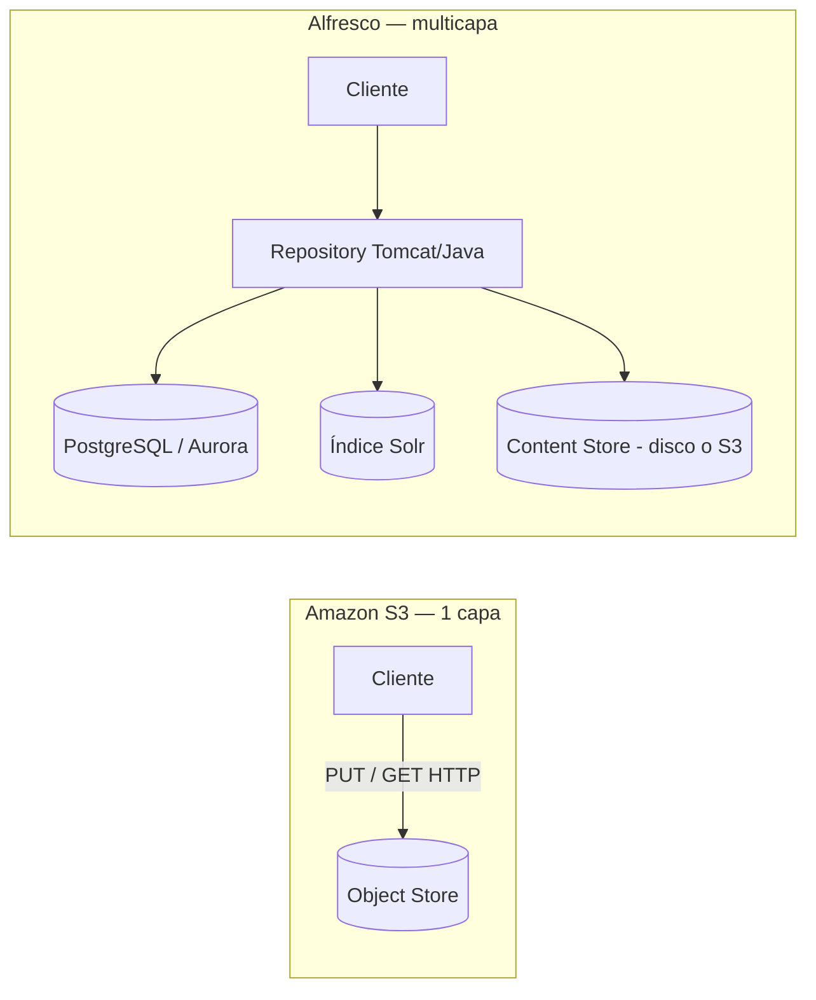
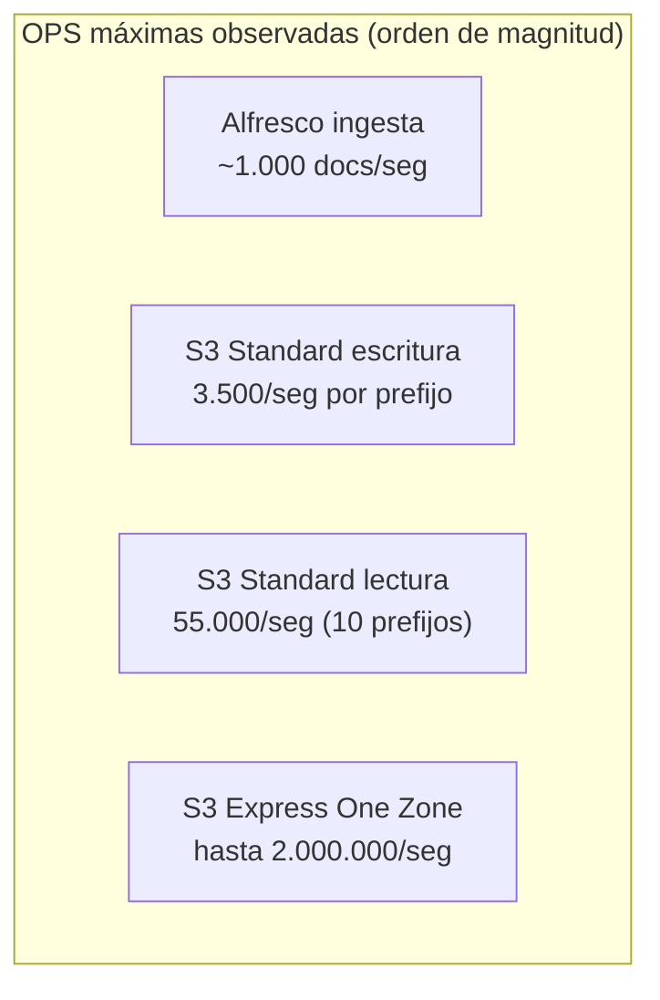
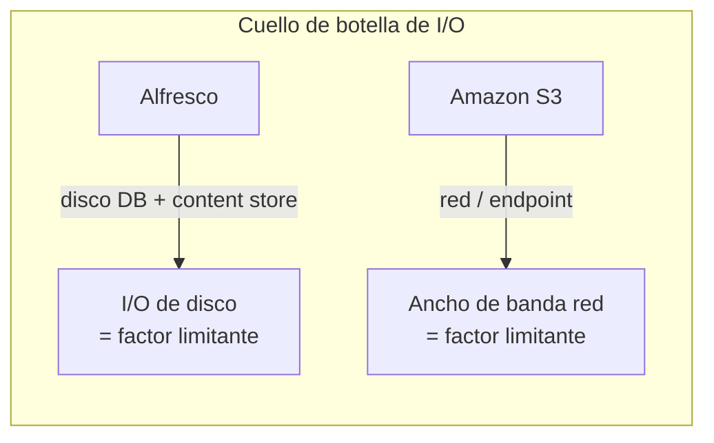
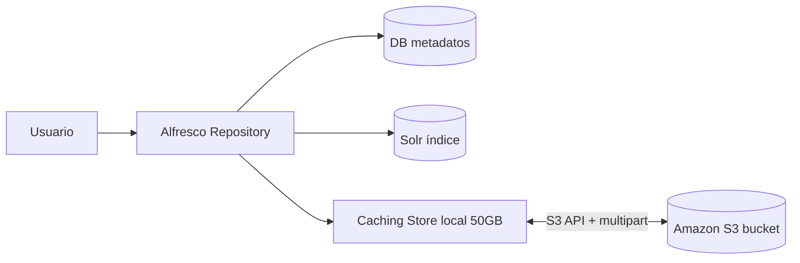

# Alfresco vs. Amazon S3: Análisis de Operaciones por Segundo (OPS) e I/O

> Documento técnico comparativo · Junio 2026
> Enfoque: rendimiento de operaciones por segundo y entrada/salida (I/O) en dos soluciones de almacenamiento/gestión de contenido de alcance similar.

---

## 1. Objetivo

Analizar y comparar el rendimiento de **operaciones por segundo (OPS / TPS)** y de **I/O** entre:

- **Una solución basada en Alfresco** (Alfresco Content Services — ECM completo: repositorio + base de datos + índice Solr + content store), y
- **Una solución basada en Amazon S3** (almacenamiento de objetos nativo, usado directamente como backend de contenido).

El propósito es determinar, con datos numéricos de fuentes confiables, **cuántas operaciones por segundo soporta cada arquitectura**, **cómo se comporta su I/O** (latencia, throughput, cuellos de botella) y en qué escenarios conviene cada una.

> **Nota de alcance ("casos similares").** Para que la comparación sea justa se toman como referencia despliegues de escala equivalente y, cuando es posible, sobre la **misma infraestructura (AWS)**: el *benchmark oficial de Alfresco de 1.000 millones de documentos sobre AWS + Aurora* frente a los *límites de rendimiento publicados por AWS para S3*. Es importante entender que **no son capas idénticas**: Alfresco es una plataforma ECM (metadatos, versionado, permisos, búsqueda, workflow) donde una "operación" implica varias capas; S3 es un almacén de objetos donde una "operación" es una petición HTTP (PUT/GET). De hecho, **Alfresco puede usar S3 como su content store**, por lo que además de comparables son **complementarios**.

---

## 2. Fuentes de información

### Referencias primarias (fabricantes)

| # | Fuente | Organización | Contenido relevante | Enlace |
|---|--------|--------------|---------------------|--------|
| 1 | *Best practices design patterns: optimizing Amazon S3 performance* | **Amazon (AWS Docs)** | Límites oficiales de requests/seg por prefijo; latencias | https://docs.aws.amazon.com/AmazonS3/latest/userguide/optimizing-performance.html |
| 2 | *Performance design patterns for Amazon S3* | **Amazon (AWS Docs)** | Escalado, errores 503, retries, multiprefijo | https://docs.aws.amazon.com/AmazonS3/latest/userguide/optimizing-performance-design-patterns.html |
| 3 | *S3 Express One Zone — High-Performance Storage* | **Amazon (AWS)** | Hasta 2 M req/seg por directory bucket; latencia ms | https://aws.amazon.com/s3/storage-classes/express-one-zone/ |
| 4 | *The Alfresco ECM 1 Billion Document Benchmark on AWS and Aurora* | **Alfresco (oficial)** | 1000 docs/seg de ingesta, >2000 docs/seg indexado | https://www.slideshare.net/slideshow/the-alfresco-ecm-1-billion-document-benchmark-on-aws-and-aurora-benchmark-details-and-scalability-recommendations/54444004 |
| 5 | *Technical Whitepaper: Alfresco Content Services on AWS Benchmark Results* | **Alfresco (oficial)** | Búsqueda, fetch, update, upload/download a escala | https://www.alfresco.com/technical-whitepaper/alfresco-content-services-aws-benchmark-results |
| 6 | *Content Connector for AWS S3 (docs)* | **Alfresco / Hyland** | Arquitectura del S3 connector, caching store, multipart | https://docs.alfresco.com/aws-s3/latest/ |
| 7 | *Sizing your Alfresco platform* | **Alfresco (L. Cabaceira)** | Definición de "transacción", pesos de operación, I/O de DB | https://www.slideshare.net/slideshow/sizing-your-alfrescoplatform/40139663 |

### Referencias secundarias (técnicas / independientes)

| # | Fuente | Contenido | Enlace |
|---|--------|-----------|--------|
| 8 | AWS re:Post — límites reales de lectura por prefijo | Burst real >28.500 GET/seg observado | https://repost.aws/questions/QUM5pQi20uSWK3lWoCH34W5w/ |
| 9 | AWS re:Post — *S3 Express throughput capped at NAT Gateway* | Benchmark de I/O: 55,7 Gbps vs 25 Gbps, p99 latencia | https://repost.aws/articles/ARwllpT3g9QH2zqh5Z5L2LgQ/ |
| 10 | Vantage / Pulumi / Sedai — análisis S3 Express One Zone | TPS, latencia, costo | https://www.vantage.sh/blog/amazon-s3-express-one-zone |
| 11 | Alfresco benchmark report BL100093 (Unisys ES7000) | 107 M docs, 140 docs/seg, I/O de disco | https://www.slideshare.net/slideshow/alfresco-benchmark-reportbl100093/5869700 |
| 12 | *Troubleshooting / Tuning Alfresco Content Services* | Solr eventual-consistency, I/O de DB e índice | https://hub.alfresco.com/t5/alfresco-premier-services-blog/ |

---

## 3. Análisis técnico

### 3.1. Qué es una "operación" en cada arquitectura

La unidad de medida no es idéntica, y entender esto es clave:

- **Amazon S3:** una operación = **una petición HTTP a la API** (PUT, COPY, POST, DELETE, GET, HEAD, LIST). Es atómica y de una sola capa (red → almacén de objetos).
- **Alfresco:** una operación = **una transacción del repositorio** (crear, navegar, descargar, actualizar, buscar, eliminar). Según la guía de sizing oficial, cada transacción atraviesa **varias capas**: Repository (Java/Tomcat) + Base de datos + índice Solr + Content Store. Por eso una sola "operación de usuario" en Alfresco puede generar **múltiples operaciones de I/O subyacentes** (lectura de DB, escritura en TLOG, lectura de índice, lectura/escritura del fichero).



> **Implicación directa:** los números de S3 (miles de req/seg) y los de Alfresco (cientos–miles de docs/seg) **no se comparan 1:1**; se comparan por *capacidad efectiva de la solución completa* y por *perfil de I/O*.

---

### 3.2. Operaciones por segundo — Amazon S3 (datos oficiales AWS)

**S3 Standard** (por *prefijo* particionado, sin límite de número de prefijos):

| Tipo de operación | Límite garantizado por prefijo |
|-------------------|--------------------------------|
| PUT / COPY / POST / DELETE (escritura) | **≥ 3.500 req/seg** |
| GET / HEAD (lectura) | **≥ 5.500 req/seg** |

Como **no hay límite de prefijos**, el rendimiento escala linealmente con la paralelización:

```
Lecturas/seg = 5.500 × (nº de prefijos)

  1 prefijo   →   5.500 GET/seg
  3 prefijos  →  16.500 GET/seg
 10 prefijos  →  55.000 GET/seg
 20 prefijos  → 110.000 GET/seg
```

> En la práctica, los límites son **guías, no topes duros**: un caso documentado en AWS re:Post midió ráfagas de **~28.500 GET/seg** sobre un solo prefijo antes del throttling (errores HTTP 503 *Slow Down*).

**S3 Express One Zone** (directory buckets, almacenamiento de alto rendimiento):

| Métrica | Valor (AWS oficial) |
|---------|---------------------|
| Requests por segundo | **Hasta 2.000.000 req/seg por directory bucket** (cientos de miles sostenidos) |
| Latencia | **Milisegundos de un solo dígito** (hasta 10× más rápido que S3 Standard) |
| Costo de request | Hasta 50–80% menor que S3 Standard |
| Durabilidad | 99,999999999% (una sola AZ) |

**Gráfico — OPS de lectura de S3 según paralelización (datos AWS):**

```
GET/seg
110.000 |                                        ██  (20 prefijos)
 90.000 |
 70.000 |
 55.000 |                          ██              (10 prefijos)
 40.000 |
 16.500 |            ██                            (3 prefijos)
  5.500 |   ██                                     (1 prefijo)
        +---------------------------------------------
            1        3            10           20   (nº de prefijos)
```

---

### 3.3. Operaciones por segundo — Alfresco (benchmarks oficiales)

**Benchmark oficial Alfresco — 1.000 millones de documentos sobre AWS + Aurora (2015):**

| Métrica | Valor medido |
|---------|--------------|
| Arquitectura | 10 nodos Alfresco 5.1 + 20 nodos Solr 4 (sharding) + 1 Aurora DB |
| Ingesta de documentos | **1.000 docs/seg** (≈ 86 millones/día) |
| Velocidad de indexado | **> 2.000 docs/seg** (1.000 M indexados en 5 días) |
| Usuarios concurrentes (Share) | 500 |
| Sesiones CMIS concurrentes | 200 |
| Búsquedas (metadata + full text) sobre 1.000 M docs | **1,2 búsquedas/seg** contra 20 shards (~5 s/consulta) |
| Consulta transaccional (TMDQ) `IN_FOLDER` | ~160 ms |
| Consulta transaccional (TMDQ) `CMIS:NAME` (=, LIKE) | ~20 ms |
| Carga CPU base de datos | 8–10% |
| Carga CPU por nodo Alfresco | 25–30% |

**Benchmark histórico (Unisys ES7000, 107 M docs):**

| Métrica | Valor |
|---------|-------|
| Documentos almacenados | 107 millones |
| Ingesta | 140 docs/seg |
| CPU app server (media) | ~20% |
| Cuello de botella de I/O | El único disco con cola alta fue el **content store** |

**Pesos y tiempos de respuesta esperados por operación (guía de sizing oficial Alfresco):**

| Operación | Tiempo esperado | Peso (%) | Capas con I/O |
|-----------|-----------------|----------|----------------|
| Browse / Read | 2 s | 50 | Repo / Solr / DB |
| Download | 3 s | 20 | Repo (Content Store) |
| Write / Upload | 5 s | 10 | Repo / Solr / DB |
| Search (metadata) | 2 s | 10 | DB / Solr |
| Delete | 3 s | 5 | Repo / DB |
| Full Text Search | 5 s | 5 | Solr |

> La capacidad real (C.A.R. — *"máximo de transacciones por segundo antes de degradar la respuesta esperada"*) depende de concurrencia esperada, *think time* y tiempos de respuesta acordados. No es un número fijo como en S3, sino una función de la carga.

---

### 3.4. Comparativa directa de OPS

| Dimensión | **Alfresco (ECM)** | **Amazon S3** |
|-----------|--------------------|----------------|
| Unidad de operación | Transacción multicapa (create/read/update/delete/search) | Petición HTTP atómica (PUT/GET/…) |
| Escritura/ingesta | ~1.000 docs/seg (benchmark 10 nodos AWS) | 3.500 PUT/seg por prefijo (× nº prefijos) |
| Lectura | Limitada por DB+Solr+ContentStore | 5.500 GET/seg por prefijo → 55.000+ con 10 prefijos |
| Búsqueda de contenido | **Sí, nativa** (Solr) — 1,2 búsq/seg sobre 1.000 M docs | **No** (S3 no busca contenido; requiere Athena/OpenSearch externo) |
| Pico extremo | Escala añadiendo nodos (escalado horizontal manual) | Hasta **2 M req/seg** (S3 Express One Zone) |
| Escalado | Manual (más nodos repo/Solr, tuning DB) | Automático y elástico (gestionado por AWS) |



---

### 3.5. Análisis de I/O (entrada/salida)

#### Perfil de I/O de Alfresco

El I/O de Alfresco está **dominado por la base de datos y el disco del content store**, no por la red:

- En el peor caso (DB grande que no cabe en caché), **cada transacción** puede provocar varias operaciones de disco: *seek a fichero de DB → lectura → seek a log → escritura de log → flush → seek metadata → escritura metadata → flush*. Esto hace que el I/O de disco sea el factor más lento frente a CPU.
- El índice **Solr es de consistencia eventual**: el contenido no se indexa dentro de la transacción, sino que Solr consulta los *change sets* y los indexa después → reduce el I/O síncrono pero introduce latencia de visibilidad en búsqueda.
- Recomendaciones oficiales de tuning: latencia red↔DB **< 1 ms** (idealmente), round-trip > 1 ms degrada notablemente el rendimiento; en *bulk load* de 1.000 docs/seg el fichero TLOG de Solr puede acumular ~3,6 M de documentos crudos/hora.
- El benchmark Unisys confirmó que **el content store fue el único disco con cola de I/O alta**.

#### Perfil de I/O de S3

El I/O de S3 está **dominado por la red y la latencia de objeto**, no por el disco local:

| Métrica de I/O | S3 Standard | S3 Express One Zone |
|----------------|-------------|---------------------|
| Latencia primer byte (objetos pequeños) | ~100–200 ms | **single-digit ms** (~1 dígito) |
| Throughput por instancia EC2 | Hasta **100 Gb/s** (instancia única) | Escala a múltiples Tb/s agregando instancias |
| Throughput agregado | Múltiples Tb/s en data lakes | Diseñado para ráfagas altas sostenidas |

**Benchmark de I/O real (AWS re:Post, objetos de 32 MB, instancia NIC 150 Gbps):**

| Ruta de red | Throughput @ 64 conexiones | p99 latencia |
|-------------|----------------------------|--------------|
| VPC Gateway Endpoint | **55,7 Gbps** (sigue escalando) | 255–326 ms |
| NAT Gateway | **~25 Gbps** (techo plano) | sube a >1,2 s |

> Lección de I/O para S3: a baja concurrencia la latencia por request es idéntica (~250 ms para 32 MB); el valor del endpoint correcto está en el *headroom* de throughput. Añadir paralelismo más allá del techo de banda **empeora** la latencia de cola (encolamiento).



#### Caso especial: Alfresco *usando* S3 como content store

Cuando se combina Alfresco + S3 Connector, el I/O cambia de naturaleza:

- El content store pasa de disco local a **objetos en S3** vía API.
- Para mitigar la latencia de red de S3, el connector usa un **Caching Content Store local** (por defecto **50 GB** de disco) que cachea el contenido recientemente usado.
- Ficheros > **20 MB** se suben con **multipart upload** (subida en paralelo de las partes) para mejorar el throughput.
- Recomendación oficial: ejecutar Alfresco en **EC2 en la misma región** que el bucket S3 para minimizar latencia.



**Imagen sugerida (enlace a diagrama oficial Alfresco):** diagrama de interacción ACS ↔ S3 Connector ↔ AWS S3 en la documentación oficial:
`https://docs.alfresco.com/aws-s3/latest/` (sección *"The following diagram shows a simple representation of how Alfresco Content Services and the S3 Connector interact with AWS S3"*).

---

### 3.6. Tabla resumen del análisis técnico

| Criterio | **Alfresco** | **Amazon S3** |
|----------|--------------|----------------|
| OPS de escritura | ~1.000 docs/seg (cluster 10 nodos) | 3.500/seg por prefijo (ilimitados prefijos) |
| OPS de lectura | Limitada por DB/Solr/store | 5.500/seg por prefijo → 55.000+ paralelizado |
| OPS pico máximo | Escalado horizontal manual | Hasta 2.000.000/seg (Express One Zone) |
| Latencia típica | 20 ms (TMDQ) a 5 s (full-text sobre 1.000 M) | 100–200 ms (Standard) / ms único (Express) |
| Factor limitante de I/O | Disco (DB + content store) | Red / ancho de banda / endpoint |
| Búsqueda de contenido | Nativa (Solr full-text + metadata) | No incluida (requiere servicios externos) |
| Escalado | Manual / planificado | Automático y elástico |
| Modelo de durabilidad | Según infra subyacente | 99,999999999% (11 nueves) |

---

## 4. Recomendaciones

**1. No son rivales 1:1, son capas distintas — y a menudo complementarias.**
Si lo que se necesita es **gestión documental** (metadatos, versionado, permisos finos, workflow, búsqueda full-text, auditoría), S3 *por sí solo* no la provee: habría que reconstruirla con DynamoDB + OpenSearch/Athena + Lambda. Para ese caso, **Alfresco** ya entrega todo ese stack. Si solo se necesita **almacenar y servir objetos** a altísima tasa, **S3** gana sin discusión.

**2. Por operaciones por segundo en bruto, S3 es superior por órdenes de magnitud.**
S3 Standard alcanza 55.000+ GET/seg con 10 prefijos y S3 Express One Zone llega a **2 millones de req/seg**, todo con escalado automático. Alfresco, incluso en su benchmark de 1.000 M de documentos, ronda **1.000 docs/seg de ingesta** y requiere 10 nodos + 20 Solr + Aurora, con escalado manual. **Para workloads de alta concurrencia tipo data lake, streaming, ML o IoT → S3 (Standard o Express One Zone).**

**3. Por latencia de I/O, depende del perfil.**
S3 Express One Zone ofrece latencia de **un dígito de milisegundo**, mejor que cualquier operación compleja de Alfresco. Pero las consultas transaccionales de metadatos de Alfresco (TMDQ ~20–160 ms) son competitivas y, sobre todo, **resuelven búsquedas semánticas que S3 no puede hacer nativamente**. Si la app es *latency-sensitive* sobre objetos → S3 Express; si es *búsqueda/consulta sobre metadatos de negocio* → Alfresco.

**4. La arquitectura recomendada en muchos casos es híbrida: Alfresco + S3 como content store.**
Se obtiene lo mejor de ambos: la **capa ECM** de Alfresco (gobierno, búsqueda, workflow) sobre el **almacenamiento elástico, barato y durable (11 nueves)** de S3. Para que el I/O rinda:
   - Ejecutar Alfresco en **EC2 en la misma región** que el bucket.
   - Dimensionar bien el **Caching Content Store** (>50 GB si el *working set* caliente es grande).
   - Aprovechar **multipart upload** para ficheros grandes.
   - Usar **VPC Gateway Endpoint** (no NAT Gateway) para no toparse con el techo de ~25 Gbps.

**5. Para mitigar los cuellos de botella de I/O propios de cada uno:**
   - **Alfresco:** discos rápidos para DB y content store, latencia red↔DB < 1 ms, optimizar índices Solr fuera de horario, escalar Solr con sharding (validado hasta 80 M docs/shard, 20 shards).
   - **S3:** distribuir la carga entre **múltiples prefijos**, implementar **retry con backoff exponencial** ante errores 503, usar **CloudFront/ElastiCache** para cachear lecturas, y **S3 Express One Zone** para hot data crítica en latencia.

**6. Regla de decisión rápida:**

| Si su necesidad principal es… | Elija… |
|-------------------------------|--------|
| Máxima tasa de req/seg, escalado automático, objetos | **Amazon S3** (Standard / Express One Zone) |
| Gestión documental con búsqueda, versionado, permisos, workflow | **Alfresco Content Services** |
| ECM gobernado + almacenamiento elástico y barato a escala | **Alfresco + S3 Connector (híbrido)** |
| Hot data con latencia de milisegundos | **S3 Express One Zone** |
| Repositorio legal/records con auditoría y retención | **Alfresco** (con S3 para tiers fríos vía lifecycle) |

---

### Anexo — Notas sobre las cifras

- Los límites de S3 (3.500 / 5.500 req/seg por prefijo) son **mínimos garantizados**, no topes; S3 escala automáticamente por encima generando temporalmente HTTP 503 mientras reparticiona.
- Las cifras de Alfresco (1.000 docs/seg, 1,2 búsq/seg) corresponden al **benchmark oficial de 1.000 M de documentos sobre AWS (Alfresco 5.1, 2015)**; versiones recientes (ACS 23.x con Solr 6 / sharding mejorado y Aurora) ofrecen mejoras, pero el orden de magnitud y el patrón de cuellos de botella (DB + content store) se mantienen.
- Tema sensible de fechas: S3 Express One Zone es de finales de 2023; sus límites (2 M req/seg por directory bucket) son los publicados por AWS a 2026. Conviene reverificar en la documentación oficial antes de un diseño en producción.